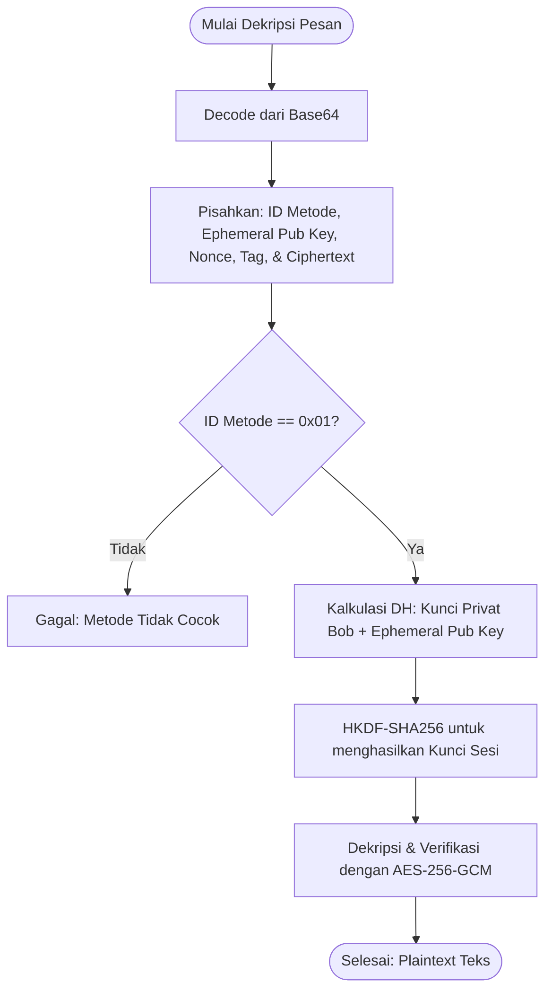

# Penjelasan Sistem Dekripsi (X25519 + AES-256-GCM)

Dokumen ini menjelaskan arsitektur, spesifikasi teknis, dan alur kerja sistem **Dekripsi** menggunakan **Metode 1 (X25519 + AES-256-GCM)** yang diimplementasikan pada aplikasi E2EE Cryptography Tool.

---

## ⚙️ Komponen Kriptografi

Proses dekripsi merupakan kebalikan dari proses enkripsi, menggunakan algoritma yang sama untuk memulihkan pesan atau berkas asli:
1.  **Kunci Privat X25519 Penerima**: Kunci rahasia asimetris yang disimpan secara lokal oleh penerima untuk melakukan pertukaran kunci Diffie-Hellman.
2.  **HKDF-SHA256**: Mengambil *shared secret* hasil pertukaran kunci dan menurunkan kembali kunci sesi simetris 256-bit yang identik dengan yang digunakan pengirim.
3.  **AES-256-GCM**: Mendekripsi *ciphertext* menggunakan kunci sesi serta melakukan verifikasi integritas data secara kriptografis menggunakan *authentication tag*.

---

## 🔄 Alur Kerja Dekripsi

### 1. Dekripsi Pesan (Teks)

Proses dekripsi pesan teks mengikuti langkah-langkah berikut:
1.  **Penerimaan Data**: Aplikasi menerima string teks terenkripsi dalam format Base64.
2.  **Pecah Sandi Base64**: Mengubah teks Base64 kembali menjadi paket data biner (*raw bytes*).
3.  **Deteksi Metode & Verifikasi Header**: Membaca byte pertama dari paket biner. Sistem memastikan byte pertama bernilai `0x01` (Metode 1) dan memastikan kunci privat pengguna adalah tipe X25519.
4.  **Parsing Paket**: Memisahkan komponen paket biner berdasarkan posisi byte:
    *   Kunci publik ephemeral pengirim (32 byte pertama setelah byte identifier).
    *   Nonce (12 byte berikutnya).
    *   Tag otentikasi (16 byte berikutnya).
    *   Ciphertext (sisa byte terakhir).
5.  **Perhitungan Shared Secret**: Mengalikan kunci privat X25519 milik penerima dengan kunci publik ephemeral pengirim.
6.  **Derivasi Kunci Sesi**: Menurunkan kunci sesi menggunakan HKDF-SHA256 dengan salt `None` dan info `b"e2ee-message-session"`.
7.  **Dekripsi & Verifikasi AEAD**: Melakukan dekripsi ciphertext menggunakan AES-256-GCM dengan kunci sesi dan nonce yang didapatkan dari paket. Jika tag otentikasi tidak valid atau data telah diubah, pustaka kriptografi akan memicu pengecualian (*error*) dan proses dihentikan.

---

### 2. Dekripsi Berkas (File)

Dekripsi berkas dilakukan secara bertahap menggunakan pembacaan *chunk-by-chunk* untuk mencegah konsumsi RAM yang tinggi saat memproses file berukuran besar.

1.  **Membaca Header Berkas**:
    *   Membaca 1 byte pertama untuk memverifikasi metode (`0x01`).
    *   Membaca 32 byte berikutnya sebagai kunci publik ephemeral pengirim.
    *   Membaca 12 byte berikutnya sebagai `base_nonce`.
2.  **Pemulihan Kunci Sesi**:
    *   Hitung *shared secret* dan turunkan kunci sesi simetris melalui HKDF-SHA256 dengan info `b"e2ee-file-session"`.
3.  **Proses Dekripsi per Chunk**:
    *   Untuk setiap bagian data yang dibaca (sebesar 64 KB data terenkripsi + 16 byte tag):
        *   Pisahkan 16 byte pertama sebagai `tag` dan sisanya sebagai `ciphertext`.
        *   Bentuk nonce dinamis untuk chunk ke-$i$ dengan rumus:
            $$\text{Nonce}_i = \text{base\_nonce}[0:8] \mathbin{\Vert} \text{chunk\_index} \text{ (4 Byte, Big-Endian)}$$
        *   Hitung parameter `is_last` (bernilai `1` jika tidak ada lagi data setelah chunk ini, `0` jika ada).
        *   Bentuk Associated Data (AD) yang identik dengan proses enkripsi:
            $$\text{AD} = \text{chunk\_index} \text{ (8 Byte, Big-Endian)} \mathbin{\Vert} \text{is\_last} \text{ (4 Byte, Big-Endian)}$$
        *   Dekripsi data menggunakan AES-256-GCM. Jika verifikasi tag otentikasi gagal, operasi dekripsi dibatalkan seketika.
4.  **Penghapusan File Gagal (Safe Rollback)**:
    Jika terjadi kegagalan verifikasi integritas di tengah proses dekripsi, aplikasi akan secara otomatis menghapus file keluaran setengah jadi untuk mencegah tersimpannya data yang rusak/tidak lengkap di sistem penyimpanan pengguna.

---

## 💻 Referensi Kode Implementasi

Logika dekripsi di atas diimplementasikan pada berkas sumber berikut:
*   **Dekripsi Pesan**: Fungsi [decrypt_message](file:///d:/Visual%20Studio%20code/tugas/enkripsi-dekripsi-keamanan-siber/src/crypto.py#L203-L241)
*   **Dekripsi Berkas**: Fungsi [decrypt_file](file:///d:/Visual%20Studio%20code/tugas/enkripsi-dekripsi-keamanan-siber/src/crypto.py#L478-L513) dan bagian pemrosesan streaming didekripsi di [L565-L591](file:///d:/Visual%20Studio%20code/tugas/enkripsi-dekripsi-keamanan-siber/src/crypto.py#L565-L591)
