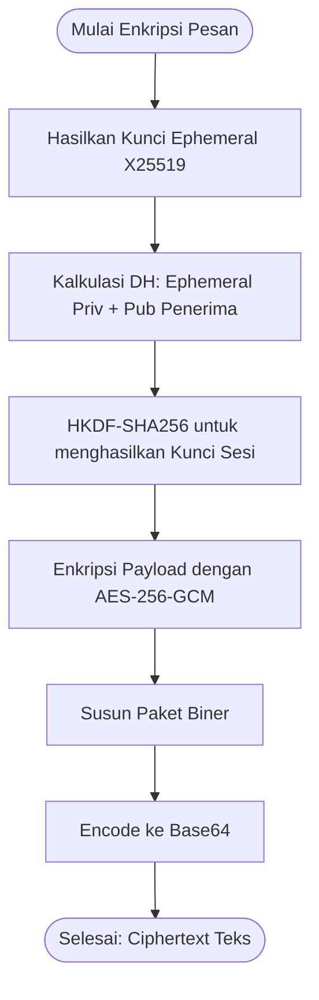

# Penjelasan Sistem Enkripsi (X25519 + AES-256-GCM)

Dokumen ini menjelaskan arsitektur, spesifikasi teknis, dan alur kerja sistem **Enkripsi** menggunakan **Metode 1 (X25519 + AES-256-GCM)** yang diimplementasikan pada aplikasi E2EE Cryptography Tool.

---

## ⚙️ Komponen Kriptografi

Sistem ini menggunakan skema **Enkripsi Hibrida (Hybrid Encryption)** dengan komponen berikut:
1.  **X25519**: Algoritma pertukaran kunci berbasis kurva eliptik (ECDH) berkinerja tinggi untuk menghasilkan kesepakatan kunci (*shared secret*) secara aman tanpa mengirimkan kunci utama.
2.  **HKDF (HMAC-based Extract-and-Expand Key Derivation Function)** dengan hash **SHA-256**: Digunakan untuk menurunkan *shared secret* menjadi kunci sesi simetris 256-bit.
3.  **AES-256-GCM (Galois/Counter Mode)**: Algoritma enkripsi simetris terotentikasi (AEAD) yang menghasilkan *ciphertext* (data terenkripsi) sekaligus *authentication tag* (untuk menjamin keutuhan data).

---

## 🔄 Alur Kerja Enkripsi

### 1. Enkripsi Pesan (Teks)

Proses enkripsi teks mengikuti langkah-langkah berikut:
1.  **Pembangkitan Kunci Sementara (Ephemeral Key)**: Aplikasi membangkitkan pasangan kunci X25519 sementara (*ephemeral private key* dan *ephemeral public key*).
2.  **Pertukaran Kunci (Key Exchange)**: *Ephemeral private key* dikalikan dengan kunci publik penerima (Bob) untuk menghasilkan *shared secret*.
3.  **Derivasi Kunci Sesi**: *Shared secret* dimasukkan ke dalam HKDF-SHA256 dengan parameter salt `None` dan info `b"e2ee-message-session"` untuk menghasilkan kunci sesi simetris 256-bit.
4.  **Enkripsi Payload**: Pesan teks dienkripsi menggunakan AES-256-GCM dengan kunci sesi tersebut dan *nonce* acak 12-byte. Proses ini menghasilkan *ciphertext* dan *authentication tag* 16-byte.
5.  **Penyusunan Paket**: Data dibungkus ke dalam satu rangkaian *binary packet*.
6.  **Pengodean Base64**: Paket biner tersebut diubah ke format teks Base64 agar mudah ditransmisikan.



#### Struktur Paket Biner Pesan Terenkripsi:
```text
[0x01 (1 Byte)] + [Ephemeral Pub Key (32 Byte)] + [Nonce (12 Byte)] + [Tag (16 Byte)] + [Ciphertext]
```
*   **Byte 0**: Identifier metode (`0x01`).
*   **Byte 1-32**: Kunci publik ephemeral pengirim (32 byte).
*   **Byte 33-44**: Nonce acak (12 byte).
*   **Byte 45-60**: Tag otentikasi GCM (16 byte).
*   **Byte 61+**: Ciphertext dari pesan teks.

---

### 2. Enkripsi Berkas (File)

Untuk berkas berukuran besar, aplikasi menggunakan sistem pembacaan bertahap (*chunk-by-chunk*) sebesar **64 KB** guna menghindari lonjakan penggunaan memori RAM.

1.  **Pembangkitan Header**:
    *   Hasilkan kunci ephemeral X25519 dan hitung kunci sesi menggunakan HKDF-SHA256 dengan info `b"e2ee-file-session"`.
    *   Hasilkan `base_nonce` acak sepanjang 12 byte.
    *   Tulis header berkas ke dalam file tujuan `.enc` dengan format:
        ```text
        [0x01 (1 Byte)] + [Ephemeral Pub Key (32 Byte)] + [Base Nonce (12 Byte)]
        ```
2.  **Enkripsi per Chunk (Blok)**:
    Untuk setiap blok data 64 KB yang dibaca dari file asal:
    *   **Nonce Dinamis**: Nonce untuk chunk ke-$i$ dihitung dengan rumus:
        $$\text{Nonce}_i = \text{base\_nonce}[0:8] \mathbin{\Vert} \text{chunk\_index} \text{ (4 Byte, Big-Endian)}$$
    *   **Associated Data (AD)**: Metadata chunk disertakan dalam perhitungan tag otentikasi GCM agar urutan chunk tidak dapat dimanipulasi:
        $$\text{AD} = \text{chunk\_index} \text{ (8 Byte, Big-Endian)} \mathbin{\Vert} \text{is\_last} \text{ (4 Byte, Big-Endian)}$$
    *   **Enkripsi Chunk**: Blok data dienkripsi dengan AES-256-GCM menggunakan $\text{Nonce}_i$ dan $\text{AD}$.
    *   **Penulisan**: Hasil enkripsi ditulis langsung ke file tujuan dengan format:
        ```text
        [Tag (16 Byte)] + [Ciphertext Chunk]
        ```

---

## 💻 Referensi Kode Implementasi

Logika enkripsi di atas diimplementasikan pada berkas sumber berikut:
*   **Enkripsi Pesan**: Fungsi [encrypt_message](file:///d:/Visual%20Studio%20code/tugas/enkripsi-dekripsi-keamanan-siber/src/crypto.py#L76-L107)
*   **Enkripsi Berkas**: Fungsi [encrypt_file](file:///d:/Visual%20Studio%20code/tugas/enkripsi-dekripsi-keamanan-siber/src/crypto.py#L340-L365) dan bagian penulisan streaming di [L404-L451](file:///d:/Visual%20Studio%20code/tugas/enkripsi-dekripsi-keamanan-siber/src/crypto.py#L404-L451)
